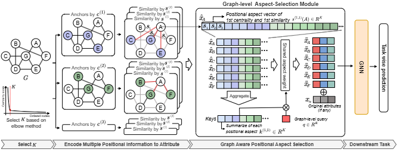

# SCOUT: Structure-Aware Aspect and Anchor-Count Selection for Node Attribute Augmentation via Positional Information

[](https://doi.org/10.1145/3774904.3792326)
[](https://doi.org/10.1145/3774904.3792326)
[](./LICENSE)
[]()
[]()

<p align="center">
  
</p>

SCOUT is a model-agnostic augmentation framework that enhances graph neural
networks (GNNs) when node attributes are missing, sparse, or uninformative, by
leveraging multi-aspect positional information (PI) together with a graph-aware
anchor-selection mechanism.

This repository is the official reference implementation of the paper published
at **The Web Conference (WWW) 2026**.

- **Paper:** *SCOUT: Structure-Aware Aspect and Anchor-Count Selection for Node
  Attribute Augmentation via Positional Information*
- **DOI:** [10.1145/3774904.3792326](https://doi.org/10.1145/3774904.3792326)
- **Venue:** [The Web Conference (WWW) 2026](https://www2026.thewebconf.org)

---

## Abstract

When node attributes are absent or limited, GNNs often fail to distinguish
structurally similar nodes, which degrades downstream performance.
Positional-information augmentation addresses this by selecting representative
nodes as *anchors* and encoding each node's relation to those anchors as new
features. Its effectiveness, however, hinges on two graph-dependent choices:
(1) the structural measures used for anchor selection and node–anchor scoring,
and (2) the anchor-count `K`.

SCOUT removes the manual tuning:

- It selects positional aspects (centrality–similarity pairs) with a graph-level
  attention selector.
- It determines the anchor-count per graph with a principled elbow method
  grounded in power-law centrality distributions.
- It augments node features with positional information that complements the
  original attributes when they are present.

This yields consistent gains on link prediction and node classification, both
with and without original node attributes.

---

## Scope of this repository

The code covers the citation-graph experiments and the analyses behind the
method section of the paper.

| Component | Availability | Entry point |
|---|---|---|
| Positional attribute generation (16 aspect blocks) | Included | `src/core/generate_attributes.py` |
| Elbow-based anchor-count selection | Included | `src/core/elbow_selector.py` |
| Graph-level aspect attention gate | Included | `src/models/attr_gate.py` |
| Link prediction (Planetoid: Cora / Citeseer / Pubmed) | Included | `src/core/train_linkpred.py` |
| Node classification (Planetoid: Cora / Citeseer / Pubmed) | Included | `src/core/train_nodeclf.py` |
| Elbow / power-law diagnostics and K-sweep | Included | `src/analysis/` |
| OGB benchmarks (`ogbl-ddi`, `ogbn-arxiv`, `ogbn-mag`) | Generation code paths present; training/evaluation harness not included here | see the paper |
| Baseline methods (HPLC, P-GNN, SEAL, ...) | Compared in the paper; not vendored here | see the paper |

Amazon (Computers / Photo) and Coauthor-CS also have data-loading paths and run
with the same scripts, but were not part of the reported main tables.

---

## Installation

```bash
# Recommended: Conda
conda env create -f requirements_conda.yaml
conda activate scout

# Alternative: pip, into a fresh Python >= 3.8 environment
pip install -r requirements.txt
```

The pinned stack is PyTorch 1.13 + CUDA 11.7 + PyG 2.6. Newer PyTorch / PyG
combinations also run the citation-graph experiments.

---

## Data preparation

- **Graphs.** PyTorch Geometric downloads Planetoid automatically into
  `datasets/<Name>/` on first use. A copy of the Cora raw files is committed so
  the quick start works offline.
- **Positional attributes.** A ready-made Cora example is committed under
  `attrs/Cora_concat_centrality/` (`concat_all_top10.684.npy` and
  `meta_concat_all_top10.684.json`). Regenerate it, or build other datasets,
  with:

```bash
python -m src.core.generate_attributes \
  --dataset Cora --data_root ./datasets \
  --output_dir ./attrs/Cora_concat_centrality --prefix concat_all
# omit --top_k_percent to let the elbow selector choose K per graph
```

This produces the concatenated 16-block aspect tensor
(`{betweenness, closeness, eigenvector, pagerank}` x
`{RWR, AdaSim, RA, Jaccard}`) and a meta JSON describing `block_dims`, the
selected anchors, and the elbow metadata. Attributes are built from the training
split only (leakage-safe).

---

## Quick start

```bash
# Link prediction on Cora (without and with original features)
bash scripts/run_linkpred.sh

# Node classification on Cora (without and with original features)
bash scripts/run_nodeclf.sh
```

Direct invocation:

```bash
python -m src.core.train_linkpred \
  --dataset Cora --data_root ./datasets \
  --attr_file ./attrs/Cora_concat_centrality/concat_all_top10.684.npy \
  --meta_file ./attrs/Cora_concat_centrality/meta_concat_all_top10.684.json \
  --model gcn --decoder mlp --hidden 64 --layer 2 --epochs 2000
# add --use_raw_feature to concatenate the original node features

python -m src.core.train_nodeclf \
  --dataset Cora --data_root ./datasets \
  --attr_file ./attrs/Cora_concat_centrality/concat_all_top10.684.npy \
  --meta_file ./attrs/Cora_concat_centrality/meta_concat_all_top10.684.json \
  --model gcn --hidden 64 --layer 2 --epochs 1000 --patience 20
```

Reference flag sets are in [`configs/`](./configs).

---

## Reproducing the analyses

```bash
# Elbow points, power-law fits, ranked / log-log centrality curves
bash scripts/run_c3_elbow_analysis.sh                 # -> results/c3_elbow/

# Anchor-count K sweep against elbow K
bash scripts/run_c3_k_sweep.sh                        # -> results/c3_k_sweep/

# Figures used in the paper (elbow visualisation experiments)
bash scripts/run_elbow_visualization_experiments.sh   # -> figures/
```

The committed `figures/*.{png,pdf}` and `figures/results_elbow_analysis.csv` are
the outputs of the last command.

---

## Repository layout

```
SCOUT/
├── assets/                          # figures used in this README
├── attrs/
│   └── Cora_concat_centrality/      # committed Cora example (16-block aspect tensor + meta)
├── configs/                         # reference hyper-parameters per shipped experiment
├── datasets/Cora/raw/               # committed Cora raw files (offline example)
├── figures/                         # elbow-analysis figures and CSV (paper artifacts)
├── scripts/                         # runnable wrappers for training and analyses
├── src/
│   ├── core/
│   │   ├── generate_attributes.py   # leakage-safe positional attribute generator
│   │   ├── elbow_selector.py        # power-law / Kneedle elbow anchor-count selector
│   │   ├── train_linkpred.py        # link-prediction trainer (AUC / AP / MRR)
│   │   └── train_nodeclf.py         # node-classification trainer (Accuracy / macro-F1)
│   ├── models/
│   │   ├── attr_gate.py             # MeasureAttentionGateV3, graph-level aspect attention
│   │   ├── encoder.py               # GCN / GraphSAGE encoder
│   │   ├── decoder.py               # inner-product / MLP link decoders
│   │   └── heads.py                 # MLP node-classification head
│   ├── utils/data_loader.py         # link-prediction and node-classification loaders
│   └── analysis/                    # elbow / power-law diagnostics, K-sweep summaries
├── requirements.txt
├── requirements_conda.yaml
├── CITATION.cff
└── LICENSE
```

---

## Results

The numbers below are as reported in the paper
([10.1145/3774904.3792326](https://doi.org/10.1145/3774904.3792326)); see the
paper for full tables, baselines, and standard deviations.

| Setting | Task | Dataset | Reported gain |
|---|---|---|---|
| Without original attributes | Link prediction | `ogbl-ddi` | +26.88% Hits@20 |
| Without original attributes | Node classification | `ogbn-arxiv` | +4.52% accuracy |
| With original attributes | Node classification | `ogbn-mag` | +11.69% accuracy |

To reproduce the shipped Cora link-prediction run locally:

```bash
bash scripts/run_linkpred.sh   # writes logs/cora_wofeat_gcn.log and logs/cora_wfeat_gcn.log
```

---

## Troubleshooting

- **`Attribute files not found`.** Pass `--attr_file` and `--meta_file` that
  belong to the same folder produced by `generate_attributes.py`; the
  `meta_*.json` must sit next to its `*.npy`.
- **CUDA out of memory.** Reduce `--hidden`, `--att_dim`, or the anchor count
  (`--max_anchors`, or a smaller `--top_k_percent` at generation time).
- **Wrong GPU.** The scripts set `CUDA_VISIBLE_DEVICES=0`; override it in the
  environment.

---

## Citation

```bibtex
@inproceedings{seo2026scout,
  title     = {SCOUT: Structure-Aware Aspect and Anchor-Count Selection for
               Node Attribute Augmentation via Positional Information},
  author    = {Seo, Dong-Hyuk and Kim, Sein and Kim, Taeri and
               Shin, Won-Yong and Kim, Sang-Wook},
  booktitle = {Proceedings of the ACM Web Conference 2026 (WWW '26)},
  year      = {2026},
  publisher = {ACM},
  doi       = {10.1145/3774904.3792326}
}
```

## License

Released under the [MIT License](./LICENSE).
